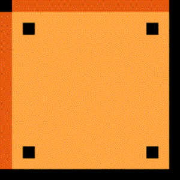

HW_Hangman-Game

Live Link
    https://puchk.github.io/Hangman-Game/

Description on how to use the app
    -Try to guess what the word is by typing letters on your keyboard.
    -You get 9 wrong guesses

Homework Display Requirements
    -Press any key to get started!
    -Wins: (# of times user guessed the word correctly).
    -Display correct word as blanks.
    -Reveal the letters and user guesses them.
    -Number of Guesses Remaining: (# of guesses remaining for the user).
    -Letters Already Guessed: (Letters the user has guessed, displayed like L Z Y H).
    -After the user wins/loses the game should automatically choose another word and make the user play it.

Technologies Used
    -Bootstrap and CSS for HTML layout
    -Key events to listen for the letters that the user types
    -DOM methods to update HTML with JS

Code Explanation
    -Major functions included startGame(), endGame(), and onKeyUp listeners.
    -startGame() initializes the game
        -Sets the values (e.g. guess left = 9, chooses a random word from the word bank and converts it to blanks)
    -endGame() checks to see if the user won or lost. If so, it runs startGame() to reset the game
    -onKeyUp listeners were used to track what the user guesses

Instead of using underscores and letters to display blanks and correct letters, I instead used images and put text on those images. InnerHTML only transfers text so I placed HTML code inside a variable.

for (i = 0; i < chosenWord.length; i++) {
		chosenWordSpaces[i] = "

?

";
	}
document.getElementById('blankWord').innerHTML = chosenWordSpaces.join(" ");
